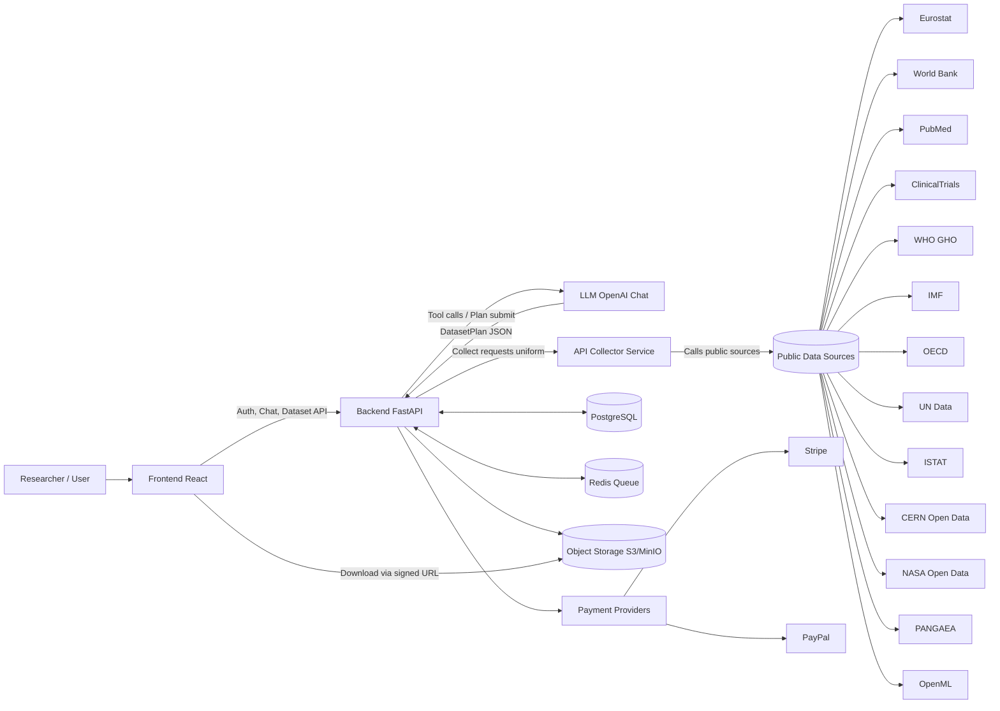
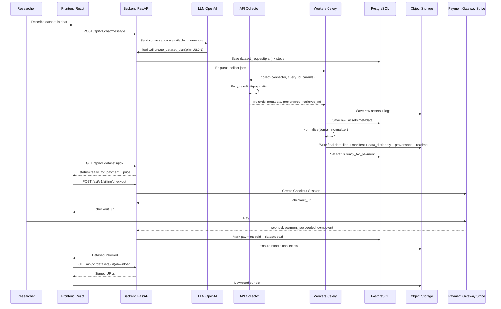
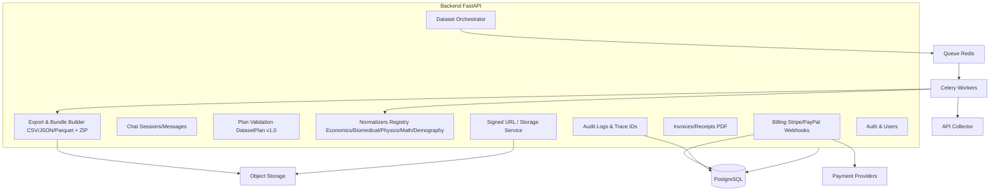

# 🏗️ Architettura Dataset On-Demand Portal

## Visione d'Insieme

**Il ricercatore parla, l'LLM interpreta, l'API Collector raccoglie, il Backend standardizza, il pagamento sblocca, il dataset viene consegnato secondo gli standard della ricerca mondiale.**

---

## 🎯 Principi Architetturali

### 1. Separazione Netta delle Responsabilità

Ogni componente ha un ruolo preciso e non invade le responsabilità degli altri:

- **LLM**: Solo interpretazione e generazione piani
- **Backend**: Solo orchestrazione e standardizzazione
- **Collector**: Solo raccolta dati da fonti pubbliche
- **Frontend**: Solo UI e UX

### 2. Single Source of Truth

- **API Collector** è l'unico punto di accesso alle fonti pubbliche
- Il backend **NON** chiama mai direttamente fonti esterne
- Tutti i dati passano attraverso il Collector con formato standardizzato

### 3. Standard Scientifici

Tutti i dataset prodotti seguono standard internazionali:
- **FAIR Principles** (Findable, Accessible, Interoperable, Reusable)
- **SDMX** per economia/statistica
- **CDISC/HL7 FHIR/OMOP** per biomedical
- **OpenML/UCI** per ML/math
- **UN SDG/Eurostat** per demografia

### 4. Auditabilità Totale

- Ogni richiesta tracciata con `trace_id`
- Provenance completo per ogni dataset
- Audit logs per azioni critiche
- Request hash per deduplicazione

---

## 📊 Diagrammi Architetturali

### System Context



### Pipeline Dataset (Sequenza Operativa)



### Componenti Backend



---

## 🔄 Flusso Dati

### 1. Richiesta Utente → DatasetPlan

```
User (chat) 
  → LLM interpreta
  → Genera DatasetPlan v1.0
  → Backend valida
  → Crea dataset_request
```

### 2. Collect → Normalize → Export

```
Backend enqueue collect jobs
  → Workers chiamano Collector
  → Collector interroga fonti pubbliche
  → Collector restituisce raw_assets standardizzati
  → Workers normalizzano (domain-specific)
  → Workers esportano (CSV/JSON/Parquet)
  → Workers generano manifest + dictionary + provenance
  → Workers creano bundle ZIP
  → Status: ready_for_payment
```

### 3. Pagamento → Consegna

```
User paga via Stripe
  → Webhook idempotente
  → Backend verifica pagamento
  → Backend genera fattura PDF
  → Backend aggiorna manifest con billing info
  → Status: paid
  → User può scaricare via signed URL
```

---

## 🔐 Sicurezza e Compliance

### Autenticazione
- JWT tokens con refresh
- Password hashing (Argon2/Bcrypt)
- Rate limiting per endpoint

### Autorizzazione
- Ownership checks (multi-tenant logico)
- Dataset accessibile solo al proprietario
- Signed URLs con scadenza

### Privacy
- No PII nei dataset biomedical
- Soft delete per account
- Audit logs completi
- GDPR compliance

### Auditabilità
- Trace ID per ogni richiesta
- Provenance completo
- Request hash per deduplicazione
- Audit logs per azioni critiche

---

## 📦 Contratti e Standard

### DatasetPlan v1.0
Vedi: `apps/backend/schemas/dataset_plan.py`

### CollectorResponse v1.0
Vedi: `apps/collector/schemas/collector_response.json`

### Manifest Universale v1.0
Vedi: `apps/backend/schemas/manifest_schema.json`

### Data Dictionary v1.0
Generato automaticamente da normalizers

---

## 🚀 Scalabilità

### Aggiungere Nuovo Connector
1. Implementa `BaseConnector` in `apps/collector/connectors/`
2. Registra in `connectors/registry.py`
3. Nessuna modifica a backend o frontend necessaria

### Aggiungere Nuovo Normalizer
1. Implementa `BaseNormalizer` in `apps/backend/normalizers/`
2. Registra in `normalizers/registry.py`
3. Nessuna modifica a pipeline necessaria

### Aggiungere Nuovo Payment Provider
1. Implementa gateway in `apps/backend/services/stripe_service.py` (o nuovo file)
2. Aggiungi webhook handler in `apps/backend/api/routers/billing.py`
3. Aggiorna frontend per nuovo provider

---

## 📚 Documentazione Correlata

- [README.md](./README.md) - Documentazione principale
- [PROMPT_MASTER.md](./PROMPT_MASTER.md) - Prompt per sviluppo
- [STANDARDS_IMPLEMENTATION.md](./STANDARDS_IMPLEMENTATION.md) - Standard implementati
- [MANIFEST_UNIVERSALE_V1_IMPLEMENTED.md](./MANIFEST_UNIVERSALE_V1_IMPLEMENTED.md) - Manifest v1.0
- [BIOMEDICAL_NORMALIZER_COMPLETE.md](./BIOMEDICAL_NORMALIZER_COMPLETE.md) - Normalizer biomedical

---

**Architettura solida, scalabile e pronta per produzione.**

