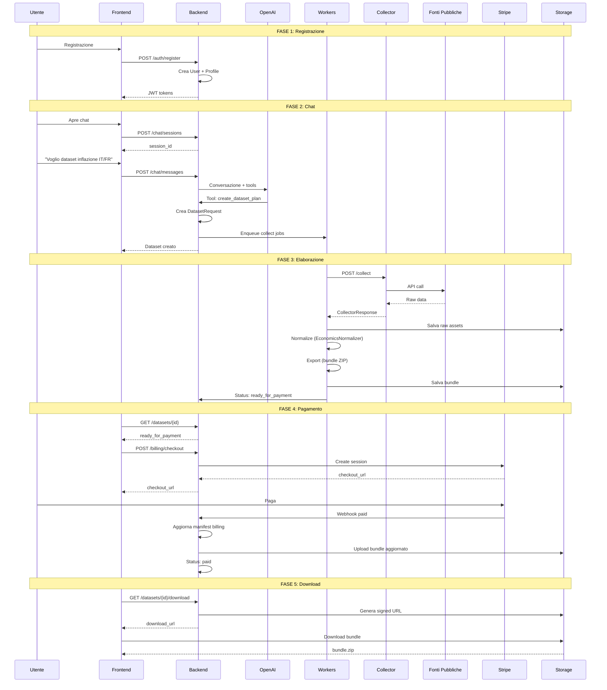

# 🔄 Flusso Completo del Servizio - Dalla Registrazione al Download

## 📋 Panoramica

Questo documento descrive **step-by-step** come funziona l'intero servizio web, dalla registrazione dell'utente fino al download del dataset finale.

---

## 🎬 FASE 1: Registrazione e Autenticazione

### 1.1 Registrazione Utente

**Endpoint**: `POST /api/v1/auth/register`

**Flusso**:
```
Utente → Frontend (form registrazione)
  → Backend /api/v1/auth/register
  → Valida email, password (Pydantic)
  → Hash password (Argon2/Bcrypt)
  → Crea User + UserProfile in DB
  → Genera JWT access_token + refresh_token
  → Ritorna tokens al frontend
```

**Dati richiesti**:
- Email (validata)
- Password (min 8 caratteri)
- Opzionale: first_name, last_name, organization

**Risposta**:
```json
{
  "access_token": "eyJ...",
  "refresh_token": "eyJ...",
  "token_type": "bearer",
  "user": {
    "id": "uuid",
    "email": "user@example.com"
  }
}
```

### 1.2 Login

**Endpoint**: `POST /api/v1/auth/login`

**Flusso**:
```
Utente → Frontend (form login)
  → Backend /api/v1/auth/login
  → Verifica email/password
  → Genera nuovi tokens
  → Ritorna tokens
```

### 1.3 Refresh Token

**Endpoint**: `POST /api/v1/auth/refresh`

**Flusso**:
```
Frontend (token scaduto)
  → Backend /api/v1/auth/refresh
  → Valida refresh_token
  → Genera nuovo access_token
  → Ritorna nuovo token
```

### 1.4 Gestione Profilo

**Endpoint**: `GET /api/v1/users/me`, `PATCH /api/v1/users/me`

**Flusso**:
```
Utente autenticato
  → Backend verifica JWT
  → Recupera/aggiorna UserProfile
  → Ritorna dati profilo
```

---

## 📦 FASE 2: Selezione Pacchetto e Categorie

### 2.1 Visualizzazione Pacchetti Disponibili

**Endpoint**: `GET /api/v1/packages`

**Flusso**:
```
Utente → Frontend (pagina pacchetti)
  → Backend /api/v1/packages
  → Ritorna lista pacchetti disponibili:
    - Single (1 dataset) - €9.99
    - Starter Pack (3 datasets) - €24.99
    - Researcher Bundle (5 datasets) - €39.99
    - Team Pack (7 datasets) - €54.99
    - Lab Package (10 datasets) - €74.99
    - Department Bundle (15 datasets) - €99.99
    - Institution Pack (20 datasets) - €129.99
    - Enterprise Bundle (50 datasets) - €299.99
    - Ultra Package (100 datasets) - €499.99
```

**Risposta**:
```json
{
  "packages": [
    {
      "id": "uuid",
      "name": "Starter Pack",
      "size": "SMALL",
      "dataset_count": 3,
      "price": 24.99,
      "currency": "EUR",
      "description": "Great for small research projects",
      "is_active": true
    },
    ...
  ],
  "total": 9
}
```

### 2.2 Selezione Pacchetto e Categorie

**Endpoint**: `POST /api/v1/packages/select`

**Flusso**:
```
Utente → Frontend (seleziona pacchetto + categorie)
  → Backend /api/v1/packages/select:
    {
      "package_id": "uuid",
      "selected_domains": ["economics", "biomedical", "physics"]
    }
  
  Backend:
  → Verifica che utente non abbia già pacchetto attivo con crediti
  → Crea UserPackage:
    - user_id
    - package_id
    - selected_domains (categorie selezionate)
    - total_datasets (dal package)
    - remaining_datasets (uguale a total)
    - status: ACTIVE
    - payment_id: null (sarà settato dopo pagamento)
  → Ritorna UserPackage
```

**Risposta**:
```json
{
  "id": "uuid",
  "user_id": "uuid",
  "package": {
    "id": "uuid",
    "name": "Starter Pack",
    "dataset_count": 3,
    "price": 24.99
  },
  "selected_domains": ["economics", "biomedical", "physics"],
  "total_datasets": 3,
  "remaining_datasets": 3,
  "used_datasets": 0,
  "status": "active"
}
```

### 2.3 Pagamento Pacchetto

**Endpoint**: `POST /api/v1/billing/checkout?user_package_id={id}`

**Flusso**:
```
Utente → Frontend (click "Paga Pacchetto")
  → Backend /api/v1/billing/checkout?user_package_id={id}
  → Verifica UserPackage esiste e appartiene all'utente
  → Crea Stripe Checkout Session:
    - amount: package.price
    - metadata: {user_package_id, type: "package"}
  → Ritorna checkout_url
```

**Webhook Stripe**:
```
Stripe → Backend /api/v1/billing/webhooks/stripe
  → Evento: checkout.session.completed
  → Crea Payment record
  → Linka payment_id a UserPackage
  → UserPackage ora è pagato e attivo
```

### 2.4 Verifica Eligibilità

**Endpoint**: `GET /api/v1/packages/eligibility`

**Flusso**:
```
Frontend → Backend /api/v1/packages/eligibility
  → Verifica se utente ha pacchetto attivo
  → Ritorna:
    {
      "has_active_package": true,
      "remaining_datasets": 2,
      "selected_domains": ["economics", "biomedical"],
      "can_create": true
    }
```

---

## 💬 FASE 3: Chat e Pianificazione Dataset

### 3.1 Creazione Chat Session

**Endpoint**: `POST /api/v1/chat/sessions`

**Flusso**:
```
Utente → Frontend (nuova chat)
  → Backend /api/v1/chat/sessions
  → Crea ChatSession in DB
  → Ritorna session_id
```

**Risposta**:
```json
{
  "id": "uuid",
  "user_id": "uuid",
  "created_at": "2025-12-14T10:00:00Z"
}
```

### 3.2 Invio Messaggio Utente

**Endpoint**: `POST /api/v1/chat/sessions/{session_id}/messages`

**Flusso**:
```
Utente → Frontend (scrive messaggio)
  → Backend /api/v1/chat/sessions/{session_id}/messages
  → Salva messaggio utente in DB (role: "user")
  → Chiama OpenAI API con:
    - Conversazione completa
    - Tool: create_dataset_plan
    - available_connectors (dal backend)
  → OpenAI risponde con:
    - Messaggio testuale (streaming)
    - Tool call: create_dataset_plan (DatasetPlan JSON)
  → Backend salva messaggio AI in DB (role: "assistant")
  → Streama risposta al frontend (SSE)
```

**Esempio richiesta utente**:
```
"Voglio un dataset sull'inflazione in Italia e Francia dal 2000 al 2024"
```

**Risposta OpenAI (tool call)**:
```json
{
  "function": "create_dataset_plan",
  "arguments": {
    "domain": "economics",
    "title": "EU Inflation (HICP) IT/FR 2000–2024",
    "sources": [
      {
        "connector": "eurostat",
        "queries": [
          {
            "query_id": "q1",
            "params": {
              "dataset": "prc_hicp_midx",
              "geo": ["IT", "FR"],
              "time": ["2000", "2024"]
            }
          }
        ]
      }
    ],
    "transformations": [
      {
        "type": "normalize_dates",
        "params": {"to": "year"}
      }
    ],
    "outputs": ["csv", "json", "parquet"]
  }
}
```

### 3.3 Creazione Dataset Request

**Endpoint**: `POST /api/v1/datasets`

**Flusso**:
```
Frontend legge DatasetPlan dal metadata del messaggio assistant
  → Frontend mostra preview del plan all'utente
  → Utente conferma "Crea Dataset"
  → Frontend chiama POST /api/v1/datasets:
    {
      "plan": {DatasetPlan JSON},
      "chat_session_id": "uuid" (opzionale)
    }
  
  Backend:
  → Verifica package eligibility:
    - Utente ha pacchetto attivo?
    - Dominio del plan è in selected_domains?
    - remaining_datasets > 0?
  → Se OK: consuma 1 credito (remaining_datasets--)
  → Valida DatasetPlan (Pydantic)
  → Crea DatasetRequest in DB:
    - user_id (da JWT)
    - chat_session_id (se fornito)
    - title (da plan.title)
    - domain (da plan.domain)
    - plan_json (DatasetPlan completo serializzato)
    - status: DRAFT
  → Crea DatasetStep per ogni source (COLLECT):
    - step_type: COLLECT
    - input_data: {connector, queries}
    - status: QUEUED
  → Crea DatasetStep NORMALIZE:
    - step_type: NORMALIZE
    - input_data: {transformations}
    - status: QUEUED
  → Crea DatasetStep EXPORT:
    - step_type: EXPORT
    - input_data: {outputs, documentation}
    - status: QUEUED
  → Log audit event (DATASET_CREATE)
  → Enqueue job: process_dataset_request.delay(dataset_id)
  → Ritorna dataset_id al frontend
```

**Risposta**:
```json
{
  "id": "uuid",
  "title": "EU Inflation (HICP) IT/FR 2000–2024",
  "domain": "economics",
  "status": "draft",
  "created_at": "2025-12-14T10:05:00Z",
  "step_count": 3
}
```

**Nota**: Il DatasetPlan viene salvato nel `message_metadata` del messaggio assistant nella chat, ma la creazione effettiva del dataset request avviene tramite endpoint separato quando l'utente conferma.

---

## ⚙️ FASE 4: Elaborazione Dataset (Pipeline Asincrona)

### 4.1 Process Dataset Request (Worker)

**Task**: `process_dataset_request(dataset_id)`

**Flusso**:
```
Celery Worker riceve job
  → Aggiorna status: DRAFT → RUNNING
  → Trova tutti i COLLECT steps (status: QUEUED)
  → Per ogni step: enqueue execute_collect_step(step_id)
```

### 4.2 Collect Step (Worker)

**Task**: `execute_collect_step(step_id)`

**Flusso**:
```
Celery Worker
  → Legge step.input_data:
    - connector: "eurostat"
    - queries: [{query_id, params}]
  → Chiama API Collector:
    POST http://collector:8002/collect
    {
      "connector_name": "eurostat",
      "query": {...},
      "dataset_step_id": "uuid"
    }
  
  Collector:
  → Trova connector (EurostatConnector)
  → Valida query
  → Chiama API Eurostat (con retry/rate-limit)
  → Trasforma risposta in formato standard
  → Salva raw_assets su S3/MinIO
  → Ritorna CollectorResponse:
    {
      "connector": "eurostat",
      "query_id": "q1",
      "retrieved_at": "2025-12-14T10:21:30Z",
      "records": [...],
      "metadata": {"row_count": 50, "bytes": 180000},
      "provenance": {
        "source_name": "Eurostat API",
        "base_url": "https://ec.europa.eu/eurostat",
        "license": {...}
      },
      "storage_path": "s3://bucket/raw/{step_id}.json"
    }
  
  Worker:
  → Salva output_data in DatasetStep:
    {
      "row_count": 50,
      "storage_path": "s3://...",
      "metadata": {...},
      "provenance": {...}
    }
  → Aggiorna status: QUEUED → SUCCESS
  
  → Se tutti i COLLECT steps completati:
    → Enqueue execute_normalize_step(normalize_step_id)
```

### 4.3 Normalize Step (Worker)

**Task**: `execute_normalize_step(step_id)`

**Flusso**:
```
Celery Worker
  → Legge dataset.domain: "economics"
  → Trova normalizer: EconomicsNormalizer (dal registry)
  → Costruisce raw_assets[] dai collect steps:
    [
      {
        "connector": "eurostat",
        "retrieved_at": "2025-12-14T10:21:30Z",
        "query_id": "q1",
        "records": [...],  // o carica da storage_path
        "dataframe": <pd.DataFrame>,  // se disponibile
        "license": {...}
      }
    ]
  → Chiama normalizer.normalize(raw_assets, dataset_plan)
    EconomicsNormalizer:
    - Unisce serie temporali
    - Normalizza date (SDMX temporal dimension)
    - Normalizza geo (ISO 3166)
    - Applica transformations dal plan
    - Ritorna DataFrame normalizzato
  
  → Chiama normalizer.validate(dataframe)
    - Verifica colonne obbligatorie
    - Verifica qualità dati
  
  → Chiama normalizer.build_data_dictionary(dataframe)
    - Genera metadata colonne (SDMX-compliant)
  
  → Salva output_data in DatasetStep:
    {
      "normalized_row_count": 50,
      "data_dictionary_columns": [...],
      "records": [...]  // o salva su storage
    }
  → Aggiorna status: QUEUED → SUCCESS
  → Enqueue execute_export_step(export_step_id)
```

### 4.4 Export Step (Worker)

**Task**: `execute_export_step(step_id)`

**Flusso**:
```
Celery Worker
  → Legge records normalizzati da normalize_step.output_data
  → Genera Manifest Universale v1.0:
    - dataset_id, title, domain
    - creator (piattaforma info)
    - owner (user_id)
    - sources[] (da collect steps)
    - transformations[] (da normalize step)
    - schema_summary (row_count, columns, granularità)
    - files[] (con checksum SHA256)
    - license, citation, quality, security
  
  → Genera Data Dictionary v1.0:
    - columns[] con metadata (type, role, description, unit)
    - Domain-specific metadata (SDMX, CDISC, etc.)
  
  → Genera Provenance:
    - sources[] con query, timestamp, license
    - transformations[] con timestamp
    - lineage completo
  
  → Genera README.txt (per physics/math)
  
  → Crea bundle ZIP:
    - {dataset_id}.csv
    - {dataset_id}.json
    - {dataset_id}.parquet
    - manifest.json
    - data_dictionary.json
    - provenance.json
    - README.txt (se presente)
  
  → Calcola checksum per ogni file
  → Aggiorna manifest.files[] con checksum
  → Valida manifest (JSON Schema)
  → Salva bundle su S3/MinIO:
    s3://bucket/datasets/{dataset_id}/bundle.zip
  
  → Salva output_data in DatasetStep:
    {
      "formats": ["csv", "json", "parquet"],
      "bundle_path": "s3://...",
      "file_size": 500000,
      "row_count": 50
    }
  → Aggiorna status: QUEUED → SUCCESS
  → Aggiorna DatasetRequest status: RUNNING → READY_FOR_PAYMENT
```

---

## 💳 FASE 5: Pagamento (Legacy - Ora i dataset sono inclusi nel pacchetto)

**Nota**: Con il nuovo sistema a pacchetti, i dataset non richiedono pagamento individuale. Il pagamento avviene al momento dell'acquisto del pacchetto. Questa sezione è mantenuta per compatibilità con il sistema legacy.

### 5.1 Visualizzazione Dataset Pronto (Legacy)

**Endpoint**: `GET /api/v1/datasets/{id}`

**Flusso**:
```
Frontend → Backend /api/v1/datasets/{id}
  → Verifica ownership (user_id)
  → Ritorna:
    {
      "id": "uuid",
      "title": "...",
      "status": "ready_for_payment",
      "price": 9.99,  // o calcolato dinamicamente
      "created_at": "...",
      "domain": "economics"
    }
```

### 4.2 Creazione Checkout Session

**Endpoint**: `POST /api/v1/billing/checkout`

**Flusso**:
```
Utente → Frontend (click "Paga")
  → Backend /api/v1/billing/checkout?dataset_request_id={id}
  → Verifica:
    - Dataset esiste e appartiene all'utente
    - Status = READY_FOR_PAYMENT
    - Non già pagato
  → Calcola amount (fisso o dinamico)
  → Chiama Stripe API:
    stripe.checkout.Session.create({
      amount: 999,  // centesimi
      currency: "eur",
      metadata: {
        "dataset_request_id": "uuid",
        "user_id": "uuid"
      },
      success_url: "https://portal.com/success",
      cancel_url: "https://portal.com/cancel"
    })
  → Crea Payment record in DB:
    - user_id
    - dataset_request_id
    - amount, currency
    - status: PENDING
    - provider: STRIPE
    - provider_checkout_session_id
  → Ritorna checkout_url
```

**Risposta**:
```json
{
  "checkout_url": "https://checkout.stripe.com/...",
  "session_id": "cs_..."
}
```

### 4.3 Pagamento Utente

**Flusso**:
```
Frontend → Redirect a checkout_url (Stripe)
  → Utente paga (Apple Pay / Google Pay / Carta)
  → Stripe processa pagamento
  → Stripe invia webhook al backend
```

### 4.4 Webhook Stripe

**Endpoint**: `POST /api/v1/billing/webhooks/stripe`

**Flusso**:
```
Stripe → Backend /api/v1/billing/webhooks/stripe
  → Verifica firma webhook (stripe-signature header)
  → Evento: checkout.session.completed
  → Trova Payment per checkout_session_id
  → Verifica idempotency (se già paid, skip)
  → Aggiorna Payment:
    - status: PENDING → COMPLETED
    - provider_ref: payment_intent_id
  → Crea Invoice (PDF):
    - Genera numero fattura
    - Genera PDF con reportlab
    - Salva su S3
    - Crea Invoice record in DB
  → Aggiorna DatasetRequest:
    - status: READY_FOR_PAYMENT → PAID
  → Aggiorna manifest con billing info:
    - Download bundle da S3
    - Aggiorna manifest.billing:
      {
        "payment_provider": "stripe",
        "payment_status": "paid",
        "payment_reference": "pi_...",
        "amount": 9.99,
        "currency": "EUR"
      }
    - Ricrea bundle con manifest aggiornato
    - Upload bundle aggiornato su S3
  → Ritorna 200 OK a Stripe
```

---

## 📥 FASE 6: Download Dataset

### 6.1 Lista Dataset Utente

**Endpoint**: `GET /api/v1/datasets`

**Flusso**:
```
Frontend → Backend /api/v1/datasets
  → Verifica JWT
  → Query DB: DatasetRequest WHERE user_id = current_user.id
  → Filtra per status (opzionale)
  → Ritorna lista:
    [
      {
        "id": "uuid",
        "title": "...",
        "domain": "economics",
        "status": "paid",
        "created_at": "...",
        "price": 9.99
      },
      ...
    ]
```

### 6.2 Dettaglio Dataset

**Endpoint**: `GET /api/v1/datasets/{id}`

**Flusso**:
```
Frontend → Backend /api/v1/datasets/{id}
  → Verifica ownership
  → Ritorna dettaglio completo:
    {
      "id": "uuid",
      "title": "...",
      "domain": "economics",
      "status": "paid",
      "created_at": "...",
      "plan": {...},
      "steps": [
        {
          "step_type": "collect",
          "status": "success",
          "output_data": {...}
        },
        ...
      ]
    }
```

### 6.3 Download Dataset

**Endpoint**: `GET /api/v1/datasets/{id}/download`

**Flusso**:
```
Frontend → Backend /api/v1/datasets/{id}/download
  → Verifica ownership
  → Verifica status = PAID (gating)
  → Trova export_step.output_data.bundle_path
  → Genera signed URL (S3 presigned URL):
    - Scadenza: 1 ora (configurabile)
    - Permessi: GET only
  → Log audit event (DOWNLOAD)
  → Ritorna signed URL
```

**Risposta**:
```json
{
  "download_url": "https://s3.amazonaws.com/bucket/datasets/{id}/bundle.zip?X-Amz-Signature=...",
  "expires_at": "2025-12-14T11:00:00Z",
  "file_size": 500000,
  "formats": ["csv", "json", "parquet"]
}
```

**Frontend**:
```
→ Mostra link download
→ Utente clicca → Download bundle ZIP
→ Utente estrae ZIP:
  - {dataset_id}.csv
  - {dataset_id}.json
  - {dataset_id}.parquet
  - manifest.json
  - data_dictionary.json
  - provenance.json
  - README.txt
```

---

## 📄 FASE 7: Fatture e Storico

### 7.1 Lista Fatture

**Endpoint**: `GET /api/v1/billing/invoices`

**Flusso**:
```
Frontend → Backend /api/v1/billing/invoices
  → Verifica JWT
  → Query DB: Invoice WHERE user_id = current_user.id
  → Ritorna lista:
    [
      {
        "id": "uuid",
        "invoice_number": "INV-2025-001",
        "invoice_date": "2025-12-14",
        "amount": 9.99,
        "currency": "EUR",
        "status": "paid",
        "dataset": {
          "id": "uuid",
          "title": "..."
        }
      },
      ...
    ]
```

### 7.2 Download Fattura

**Endpoint**: `GET /api/v1/billing/invoices/{id}/download`

**Flusso**:
```
Frontend → Backend /api/v1/billing/invoices/{id}/download
  → Verifica ownership
  → Trova Invoice.invoice_pdf_path
  → Genera signed URL
  → Ritorna URL
```

### 7.3 Storico Dataset

**Endpoint**: `GET /api/v1/datasets?status=paid`

**Flusso**:
```
Frontend → Backend /api/v1/datasets?status=paid
  → Ritorna tutti i dataset pagati dell'utente
  → Frontend mostra:
    - Lista dataset
    - Data creazione
    - Prezzo pagato
    - Link download
    - Link fattura
```

---

## 🔄 FASE 8: Gestione Account

### 8.1 Aggiorna Profilo

**Endpoint**: `PATCH /api/v1/users/me`

**Flusso**:
```
Utente → Frontend (modifica profilo)
  → Backend /api/v1/users/me
  → Aggiorna UserProfile
  → Ritorna profilo aggiornato
```

### 8.2 Cancella Account

**Endpoint**: `DELETE /api/v1/users/me`

**Flusso**:
```
Utente → Frontend (cancella account)
  → Backend /api/v1/users/me
  → Soft delete:
    - User.deleted_at = now()
    - User.is_active = False
  → Log audit event
  → Ritorna 204 No Content
  
  (Purge definitivo avviene dopo retention_days via scheduled job)
```

---

## 📊 Diagramma Flusso Completo



---

## 🔑 Punti Chiave del Flusso

### 1. Separazione Responsabilità
- **Frontend**: Solo UI/UX, non logica business
- **Backend**: Orchestrazione, validazione, standardizzazione
- **Collector**: Solo raccolta dati da fonti pubbliche
- **LLM**: Solo interpretazione e generazione piani

### 2. Pipeline Asincrona
- Tutti i job lunghi sono asincroni (Celery)
- Frontend può monitorare progress via polling o WebSocket
- Nessun timeout per operazioni lunghe

### 3. Gating Download
- Dataset scaricabile **SOLO** se `status = PAID`
- Verifica ownership su ogni richiesta
- Signed URLs con scadenza

### 4. Audit Completo
- Ogni azione tracciata con `trace_id`
- Audit logs per azioni critiche
- Provenance completo per ogni dataset

### 5. Idempotency
- Webhook pagamenti idempotenti
- Request hash per deduplicazione
- Unique constraints su DB

---

## 📝 Endpoint Completi Disponibili

### Auth
- `POST /api/v1/auth/register` - Registrazione
- `POST /api/v1/auth/login` - Login
- `POST /api/v1/auth/refresh` - Refresh token
- `POST /api/v1/auth/logout` - Logout

### Users
- `GET /api/v1/users/me` - Profilo utente
- `PATCH /api/v1/users/me` - Aggiorna profilo
- `DELETE /api/v1/users/me` - Cancella account

### Chat
- `POST /api/v1/chat/sessions` - Crea sessione
- `GET /api/v1/chat/sessions` - Lista sessioni
- `GET /api/v1/chat/sessions/{id}` - Dettaglio sessione
- `POST /api/v1/chat/sessions/{id}/messages` - Invia messaggio (streaming)

### Datasets
- `GET /api/v1/datasets` - Lista dataset utente
- `GET /api/v1/datasets/{id}` - Dettaglio dataset
- `GET /api/v1/datasets/{id}/download` - Download (solo se paid)
- `POST /api/v1/datasets/{id}/clone` - Clona dataset
- `GET /api/v1/datasets/{id}/history` - Storico versioni

### Billing
- `POST /api/v1/billing/checkout?user_package_id={id}` - Crea checkout session per pacchetto
- `POST /api/v1/billing/checkout?dataset_request_id={id}` - Crea checkout session per dataset (legacy)
- `POST /api/v1/billing/webhooks/stripe` - Webhook Stripe
- `GET /api/v1/billing/invoices` - Lista fatture
- `GET /api/v1/billing/invoices/{id}/download` - Download fattura

### Audit
- `GET /api/v1/audit/logs` - Log audit (admin)

---

## 🎯 Esempio Flusso Completo (Timeline)

```
T+0s:   Utente si registra
T+5s:   Utente apre chat
T+10s:  Utente: "Voglio dataset inflazione IT/FR 2000-2024"
T+15s:  LLM genera DatasetPlan
T+20s:  Backend crea DatasetRequest
T+25s:  Worker inizia collect
T+30s:  Collector chiama Eurostat API
T+35s:  Collector ritorna raw data
T+40s:  Worker normalizza (SDMX)
T+45s:  Worker esporta (bundle ZIP)
T+50s:  Status: ready_for_payment
T+55s:  Utente clicca "Paga"
T+60s:  Redirect a Stripe
T+90s:  Utente paga
T+95s:  Stripe webhook → Backend
T+100s: Status: paid
T+105s: Utente clicca "Download"
T+110s: Backend genera signed URL
T+115s: Utente scarica bundle.zip
```

---

**Questo è il flusso completo del servizio, dalla registrazione al download finale!** 🎉

