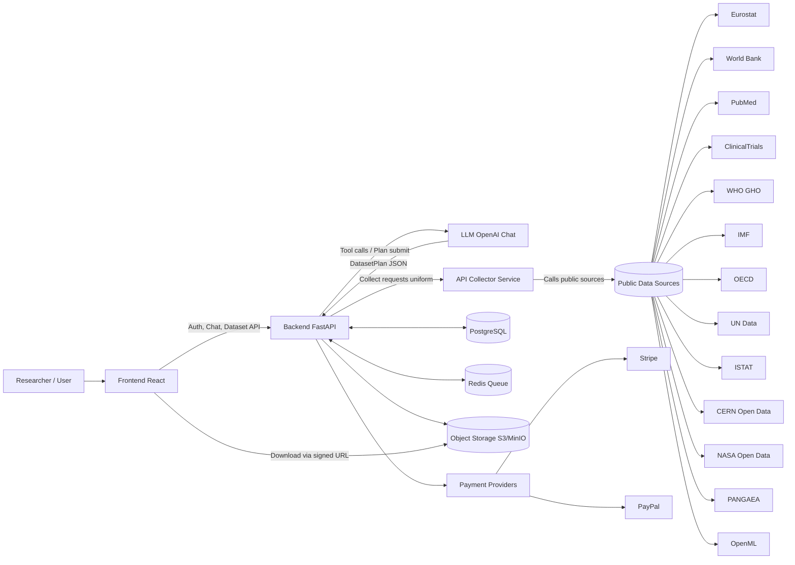
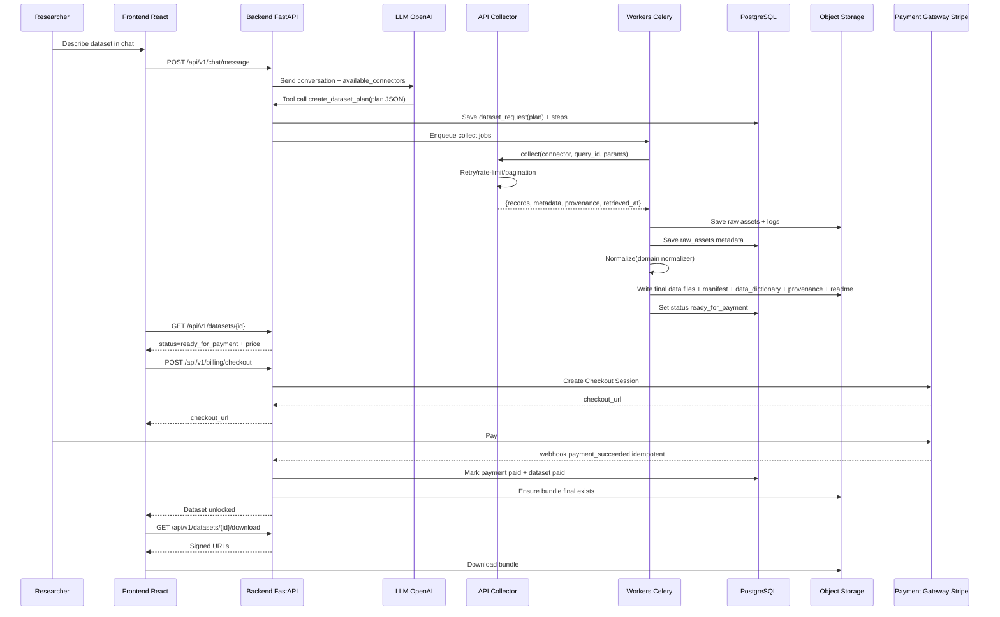
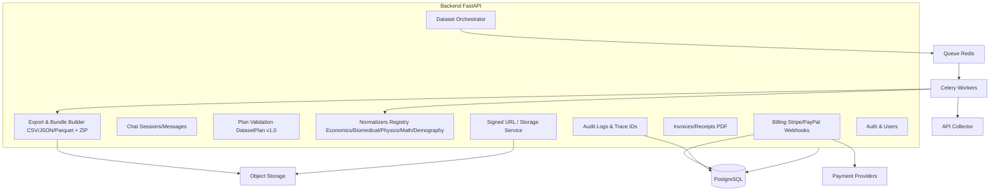

# Dataset On-Demand Portal

**Portale web per la creazione di dataset personalizzati per ricerca e analisi**

Un sistema completo che permette ai ricercatori di richiedere dataset personalizzati attraverso una chat AI, con standardizzazione automatica secondo standard internazionali (SDMX, CDISC, FAIR, OpenML, UN SDG) e consegna sicura dopo pagamento.

---

## 🎯 Visione del Prodotto

Il ricercatore parla, l'LLM interpreta, l'API Collector raccoglie, il Backend standardizza, il pagamento sblocca, il dataset viene consegnato secondo gli standard della ricerca mondiale.

---

## 🏗️ Architettura

### System Context



### Pipeline Dataset (Sequenza Operativa)



### Componenti Backend



---

## 📦 Stack Tecnologico

### Backend
- **Framework**: FastAPI + Pydantic v2
- **Database**: PostgreSQL + SQLAlchemy 2 + Alembic
- **Queue**: Redis + Celery
- **Storage**: S3-compatible (MinIO dev / DigitalOcean Spaces prod)
- **Auth**: JWT + Argon2/Bcrypt
- **Payments**: Stripe Checkout + Webhooks idempotenti

### Frontend
- **Framework**: React + Vite + TypeScript
- **UI**: Tailwind CSS + shadcn/ui
- **State**: TanStack Query
- **Real-time**: SSE/WebSocket

### AI/LLM
- **Provider**: OpenAI (Chat + Tool Calling)
- **Ruolo**: Interprete richieste utente → DatasetPlan v1.0

### Collector
- **Framework**: FastAPI
- **Connectors**: Registry-based (Eurostat, World Bank, PubMed, ClinicalTrials, WHO GHO, IMF, OECD, UN Data, ISTAT, CERN, NASA, PANGAEA, OpenML)

---

## 🔐 Responsabilità e Regole d'Oro

### 1. API Collector
**Unico servizio autorizzato a interrogare fonti pubbliche esterne**

✅ **Fa:**
- Connette e interroga tutte le API pubbliche ufficiali
- Gestisce autenticazione, rate limit, paginazione, retry, caching
- Restituisce output standardizzato: `{records, metadata, provenance, retrieved_at}`
- Audit delle richieste

❌ **Non fa:**
- Non interpreta richieste utente
- Non normalizza i dati
- Non crea dataset finali
- Non gestisce pagamenti

### 2. LLM (Chat)
**Interprete tra ricercatore e sistema**

✅ **Fa:**
- Interagisce in linguaggio naturale
- Comprende settore, periodo, geografia, variabili
- Genera DatasetPlan v1.0 validato (JSON)
- Presenta stato e istruzioni

❌ **Non fa:**
- Non interroga direttamente fonti pubbliche
- Non raccoglie dati
- Non crea dataset
- Non gestisce pagamenti

### 3. Backend
**Motore di produzione dataset e garante standard scientifici**

✅ **Fa:**
- Riceve e valida DatasetPlan
- Orchestra pipeline: collect → normalize → export → ready_for_payment
- Applica standard internazionali (SDMX, CDISC, FAIR, OpenML, UN SDG)
- Genera manifest, data dictionary, provenance
- Gestisce versioning, qualità, audit

❌ **Non fa:**
- Non dialoga con utente finale
- Non chiama direttamente fonti pubbliche
- Non esegue pagamenti

### 4. Pagamento e Consegna
**Controllo accesso e consegna sicura**

✅ **Fa:**
- Integra gateway pagamento (Stripe, PayPal)
- Verifica incasso via webhook idempotenti
- Genera bundle finale solo dopo pagamento confermato
- Crea link firmati e temporanei
- Genera fatture/ricevute PDF

❌ **Non fa:**
- Non genera dataset prima del pagamento
- Non espone dati senza autorizzazione

---

## 📋 Contratti Formali

### DatasetPlan v1.0
```json
{
  "plan_version": "1.0",
  "domain": "economics|biomedical|physics|math|demography",
  "title": "...",
  "sources": [
    {
      "connector": "eurostat|worldbank|pubmed|...",
      "queries": [
        {
          "query_id": "q1",
          "params": {...},
          "pagination": {...}
        }
      ]
    }
  ],
  "transformations": [...],
  "outputs": ["csv", "json", "parquet"],
  "documentation": {
    "include_manifest": true,
    "include_data_dictionary": true
  }
}
```

### Manifest Universale v1.0
Vedi: `apps/backend/schemas/manifest_schema.json`

### Data Dictionary v1.0
Vedi: `apps/backend/services/export_service.py` → `generate_data_dictionary()`

### CollectorResponse v1.0
Vedi: `apps/collector/schemas/collector_response.json`

---

## 🗂️ Struttura Repository

```
portal/
├── apps/
│   ├── backend/          # FastAPI backend
│   │   ├── api/routers/  # API endpoints
│   │   ├── db/models/    # SQLAlchemy models
│   │   ├── normalizers/  # Domain normalizers
│   │   ├── services/     # Business logic
│   │   └── workers/      # Celery tasks
│   ├── collector/        # API Collector service
│   │   ├── connectors/   # Source connectors
│   │   └── app/          # FastAPI app
│   └── frontend/         # React frontend
├── packages/
│   └── shared/           # Shared types/utilities
├── docs/                 # Documentation
├── infra/                # Infrastructure
│   └── docker-compose.yml
└── scripts/              # Utility scripts
```

---

## 🚀 Milestone Operative

### ✅ M0: Bootstrap
- Docker Compose (PostgreSQL, Redis, MinIO)
- Health checks per tutti i servizi

### ✅ M1: Auth & Profile
- Users + JWT + Profile UI

### ✅ M2: Chat + OpenAI Planning
- Chat sessions/messages
- SSE streaming
- Tool `create_dataset_plan`
- Validazione JSON schema

### ✅ M3: Dataset Orchestration Skeleton
- Dataset requests/steps
- Queue system
- Progress events

### ✅ M4: Collector Connectors MVP
- Eurostat + World Bank + PubMed
- Output standardizzato
- Raw assets su storage

### ✅ M5: Normalization + Export
- EconomicsNormalizer + BiomedicalNormalizer + PhysicsNormalizer + MLMathNormalizer + DemographyNormalizer
- Export CSV/JSON/Parquet
- Manifest + Data Dictionary + Provenance

### ✅ M6: Payments
- Stripe Checkout
- Webhook idempotenti
- Gating download

### ✅ M7: Invoices/Receipts
- PDF generation
- Numerazione
- UI elenco

### ✅ M8: Lifecycle
- Delete account (soft + purge)
- Audit logs

---

## 📦 Artefatti Standard (Ogni Dataset)

Ogni dataset prodotto include:

- ✅ `manifest.json` - Manifest Universale v1.0 (schema validabile)
- ✅ `data_dictionary.json` - Data Dictionary v1.0 (schema validabile)
- ✅ `provenance.json` - Fonti, query, timestamp, licenze
- ✅ `README.txt` - Descrizione e citazione
- ✅ Dati: CSV/JSON/Parquet (almeno uno)
- ✅ Bundle ZIP (default)

---

## 🧪 Testing

```bash
# Backend tests
cd apps/backend
pytest

# System tests
python scripts/test_complete_system.py

# Robustness verification
python scripts/verify_robustness.py
```

---

## 🔧 Setup Locale

### Prerequisiti
- Docker & Docker Compose
- Python 3.9+
- Node.js 18+

### Avvio

```bash
# Clone repository
git clone <repo-url>
cd AX_Dataset

# Setup environment
cp .env.example .env
# Edit .env with your keys

# Start services
docker-compose up -d

# Run migrations
cd apps/backend
alembic upgrade head

# Start backend
uvicorn app.main:app --reload --port 8001

# Start collector (separate terminal)
cd apps/collector
uvicorn app.main:app --reload --port 8002

# Start frontend (separate terminal)
cd apps/frontend
npm install
npm run dev
```

---

## 📚 Documentazione Aggiuntiva

- [Standards Implementation](./STANDARDS_IMPLEMENTATION.md) - Standard globali implementati
- [Manifest Universale v1.0](./MANIFEST_UNIVERSALE_V1_IMPLEMENTED.md) - Specifiche manifest
- [Biomedical Normalizer](./BIOMEDICAL_NORMALIZER_COMPLETE.md) - Normalizer biomedical completo
- [API Keys Management](./README_API_KEYS.md) - Gestione API keys

---

## 🎓 Standard Scientifici Supportati

- **Economics**: SDMX (Statistical Data and Metadata eXchange)
- **Biomedical**: CDISC / HL7 FHIR / OMOP Common Data Model
- **Physics/Nature**: FAIR Data Principles / NetCDF
- **ML/Math**: OpenML / UCI ML Repository conventions
- **Demography**: UN SDG Metadata / Eurostat demographic model

Tutti i dataset sono **FAIR-compliant** (Findable, Accessible, Interoperable, Reusable).

---

## 🔒 Sicurezza

- JWT authentication
- Rate limiting (slowapi)
- Security headers middleware
- Input validation (Pydantic)
- Ownership checks (multi-tenant)
- Signed URLs per download (scadenza configurabile)
- Audit logs completi

---

## 📄 Licenza

[Specificare licenza del progetto]

---

## 👥 Contributi

[Istruzioni per contribuire]

---

## 📞 Supporto

[Informazioni di contatto]

---

**Status**: ✅ Backend completo e testato. Pronto per integrazione frontend.
